# Sistema de Processamento de VR/VA (Vale Refeição/Vale Alimentação)

> **Projeto desenvolvido com base no desafio proposto no curso de Agentes Autônomos com IA Generativa do [I2A2](https://drive.google.com/file/d/1fuBCVSbP5796oc4cAtMYLEQqU3iOpLG3/view)**

## 📋 Descrição

Sistema automatizado para cálculo e processamento de benefícios de Vale Refeição (VR) e Vale Alimentação (VA) para colaboradores de uma empresa. O sistema processa dados de diferentes fontes (funcionários ativos, admitidos, desligados, férias, afastamentos, etc.) e gera relatórios mensais com cálculos baseados em regras de negócio específicas.

## 🚀 Funcionalidades

- Upload e validação automática de planilhas Excel (.xlsx)
- Processamento ETL completo: ativos, admissões, desligamentos, férias, etc.
- Cálculo de dias úteis proporcionais, valores diários por estado/sindicato
- Aplicação de regras de negócio para elegibilidade e descontos
- Geração de relatório Excel formatado, pronto para download
- Interface web interativa via Streamlit
- Logs detalhados e feedback visual do processamento


## 🏗️ Arquitetura do Sistema

```mermaid
graph TD
    %% Entrada de Dados
    subgraph "📂 Dados de Entrada"
        A1[xlsx files]
    end

    %% Aplicação Principal
    subgraph "🚀 Aplicação Principal"
        APP[app.py]
    end

    %% Módulos do Sistema
    subgraph "⚙️ Módulos do Sistema (src/)"
        PROC[agent.py]
    end

    %% Processamento de Dados
    subgraph "🔄 Pipeline ETL"
        P1[Leitura de Planilhas Excel]
        P2[Consolidação de Dados]
        P3[Aplicação de<br> Regras de Negócio]
        P4[Cálculo de VR/VA<br> pelo LLM]
        P5[Atualizações do LLM]
        P6[Geração de Relatório]
    end

    %% Regras de Negócio
    subgraph "📋 Regras de Negócio"
        R1[Funcionários Ativos: Elegíveis]
        R2[Estagiários/Aprendizes: Excluídos]
        R3[Afastados:<br> Excluídos]
        R4[Desligados:<br> Condicionais]
        R5[Valor por<br> Estado/Sindicato]
        R6[80% Empresa / 20% Funcionário]
        R7[Férias:<br>Proporcional]
    end

    %% Saída
    subgraph "📊 Relatório Final"
        OUTPUT[VR MENSAL 05-2025.xlsx]
    end

    %% Estrutura de Colunas do Relatório
    subgraph "📝 Estrutura do Relatório"
        C1[Matrícula]
        C2[Admissão]
        C3[Sindicato do<br> Colaborador]
        C4[Competência]
        C5[Dias]
        C6[Valor Diário]
        C7[Total]
        C8[Custo<br> Empresa]
        C9[Desconto<br> Profissional]
        C10[OBS<br> GERAIS]
    end

    %% Fluxo Principal
    A1 --> APP
    APP --> PROC
    PROC --> P1
    P1 --> P2
    P2 --> P3
    P4 --> P5
    P5 --> P6
    P6 --> OUTPUT
    
    %% Aplicação de Regras
    P3 -.-> R1
    R1 -.-> R2
    R1 -.-> R3
    R1 -.-> R4
    R1 -.-> R7
    R1 -.-> R5
    R1 -.-> R6
    R1 -.-> P4

    %% Estrutura do Relatório
    OUTPUT --> C1
    OUTPUT --> C2
    OUTPUT --> C3
    OUTPUT --> C4
    OUTPUT --> C5
    OUTPUT --> C6
    OUTPUT --> C7
    OUTPUT --> C8
    OUTPUT --> C9
    OUTPUT --> C10

    %% Dependências Externas
    subgraph "📦 Dependências"
        DEP1[pandas]
        DEP2[numpy]
        DEP3[openpyxl]
        DEP4[OpenAI]
        DEP5[LangChain/LangGraph]
    end

    PROC -.-> DEP1
    PROC -.-> DEP2
    PROC -.-> DEP3
    PROC -.-> DEP4
    PROC -.-> DEP5

    %% Estilos
    classDef inputData fill:#e1f5fe,stroke:#0277bd,stroke-width:2px,color:#000000
    classDef mainApp fill:#f3e5f5,stroke:#7b1fa2,stroke-width:3px,color:#000000
    classDef modules fill:#e8f5e8,stroke:#2e7d32,stroke-width:2px,color:#000000
    classDef processing fill:#fff3e0,stroke:#ef6c00,stroke-width:2px,color:#000000
    classDef rules fill:#fce4ec,stroke:#c2185b,stroke-width:2px,color:#000000
    classDef output fill:#f1f8e9,stroke:#558b2f,stroke-width:3px,color:#000000
    classDef columns fill:#f9fbe7,stroke:#827717,stroke-width:1px,color:#000000
    classDef dependencies fill:#fafafa,stroke:#61616,stroke-width:1px,color:#000000

    class A1, inputData
    class APP mainApp
    class PROC, modules
    class P1,P2,P3,P4,P5,P6 processing
    class R1,R2,R3,R4,R5,R6,R7 rules
    class OUTPUT output
    class C1,C2,C3,C4,C5,C6,C7,C8,C9,C10 columns
    class DEP1,DEP2,DEP3,DEP4,DEP5 dependencies
```

## 📊 Dados de Entrada

O sistema espera arquivos Excel com nomes e colunas padrão, por exemplo:

- **ATIVOS.xlsx**: Funcionários ativos (`MATRICULA`, `TITULO DO CARGO`, `DESC. SITUACAO`, `Sindicato`)
- **ADMISSÃO_ABRIL.xlsx**: Novos admitidos (`MATRICULA`, `Admissão`, `Cargo`)
- **DESLIGADOS.xlsx**: Funcionários desligados (`MATRICULA`, `DATA DEMISSÃO`, `COMUNICADO DE DESLIGAMENTO`)
- **FÉRIAS.xlsx**: Funcionários em férias (`MATRICULA`, `DIAS DE FÉRIAS`)
- **Base_dias_uteis.xlsx**, **Base_sindicato_x_valor.xlsx**: Dados auxiliares

> Os nomes dos arquivos podem variar, pois o sistema identifica automaticamente pelo padrão no nome.

## ⚙️ Regras de Negócio

- **Elegibilidade**: Exclui aprendizes, estagiários, diretores, afastados (licença maternidade, auxílio doença) e profissionais no exterior.
- **Desligamento**: Até dia 15 com comunicado OK = excluído; até dia 15 sem OK = VR integral; após dia 15 = VR proporcional.
- **Admissão**: Admissão no mês = VR proporcional.
- **Férias**: Desconto de dias de férias nos dias úteis.
- **Valores**: Valor diário por estado, conforme sindicato.
- **Cálculo final**: Custo empresa = 80% do valor pago; desconto profissional = 20%.

## 🛠️ Tecnologias Utilizadas

- **Python 3.12+**
- **Pandas** e **openpyxl** para manipulação de dados
- **SQLite** para persistência temporária
- **Streamlit** para interface web
- **LangGraph** e **LangChain OpenAI** para workflow e integração LLM

## 📦 Instalação

1. Clone o repositório:
   ```sh
   git clone https://github.com/costadiogo/vr-va-report.git
   cd desafio04
   ```

2. Crie e ative um ambiente virtual:
   ```sh
   python -m venv venv
   # Windows
   venv\Scripts\activate
   # Linux/Mac
   source venv/bin/activate
   ```

3. Instale as dependências:
   ```sh
   pip install -r requirements.txt
   ```

## 🚀 Como Usar

1. Execute a aplicação Streamlit:
   ```sh
   streamlit run app.py
   ```

2. Na interface:
   - Insira sua API Key da OpenAI
   - Faça upload das planilhas necessárias
   - Informe a competência (ex: 05-2025)
   - Clique em "Gerar Relatório"

3. Baixe o relatório Excel gerado ao final do processamento.

## 📝 Logs e Debug

- Logs detalhados são exibidos no terminal e na interface.
- Em caso de erro, detalhes técnicos e dicas são mostrados na interface.

## 📝 Personalização

- Para alterar o mapeamento sindicato-estado, edite [`src/state_union.py`](src/state_union.py).
- Para ajustar regras de negócio, revise os arquivos em [`src/tools/`](src/tools/).
- Para novos tipos de arquivos, adapte os padrões em [`src/agent.py`](src/agent.py).

## 📄 Licença

Este projeto está sob a licença MIT. Veja o arquivo [LICENSE](LICENSE).

---

Desenvolvido por Diogo Costa para o curso I2A2.